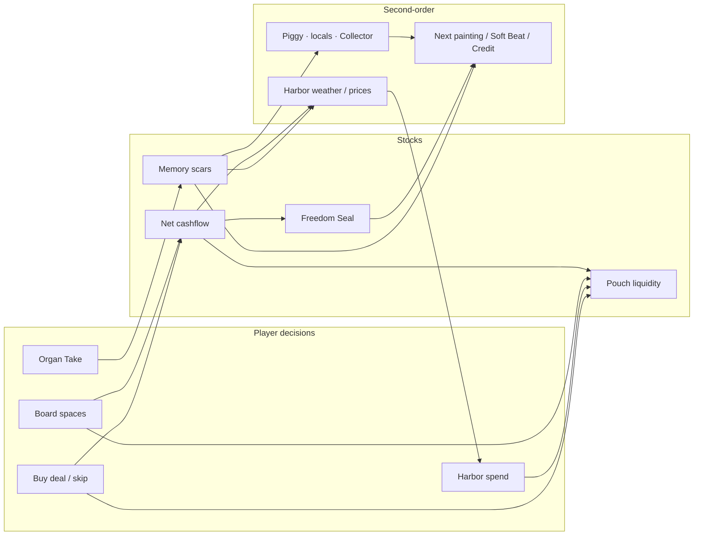

# Capital — Economy as a Dynamic System

**Companion to:** [GAME_DESIGN_LOOP.md](./GAME_DESIGN_LOOP.md) · [GAME_DESIGN_KNOWLEDGE.md](./GAME_DESIGN_KNOWLEDGE.md) · [docs/iconic-path.md](./docs/iconic-path.md)  
**Constraint:** Do not increase realism unless it creates better decisions. Fantasy = living money + cashflow journey — not a spreadsheet sim.  
**Prototype:** `?economy=1` → `EconomyLoopPrototype`

---

## Thesis

Capital’s economy is **not** a pile of counters. It is a living loop:

> **Liquidity (pouch) ↔ Cashflow (engine) ↔ Memory (scars) ↔ Harbor weather/actors ↔ next opportunity or risk**

XP, wealth ranks, and parallel soft meters are **not** the economy. If a meter never forces an opportunity cost, it is decoration — demote it from the win fantasy.

```
PLAYER DECISION
→ DIRECT ECONOMIC EFFECT
→ MARKET RESPONSE
→ OTHER ACTOR RESPONSE
→ NEW OPPORTUNITY / RISK
→ REPEAT
```

---

## Audit dimensions

### Sources

| Flow | What enters the system |
|------|------------------------|
| Pay Day (net cashflow → pouch) | Primary healthy source |
| Quest / board / minigame coin rewards | Secondary liquidity |
| Deal assets (+monthly) | Income engine |
| Daily ritual Pay Day | Retention drip |
| Scar / Memory | Identity source (not pouch) |

### Sinks

| Flow | What leaves |
|------|-------------|
| Harbor shop (pets, capsules, carpet polish, plaza) | Liquidity → cosmetics / access |
| Deal purchase costs | Liquidity → cashflow engine |
| Bills / Collector / rival raids | Forced liquidity loss |
| Living expenses + liabilities | Cashflow drain |
| Irreversible Takes | Memory / options — **not** pouch (by design) |

### Scarcity

- **Healthy:** pouch vs deal purchase; CF ≥ $30 for Freedom streak; Credit soft-lock until Freedom + mastery.  
- **Broken:** after deal pool empties, scarcity collapses — infinite Pay Day farm with no new tradeoffs.

### Abundance

- Boom weather + high CF → brighter Harbor, slight shop markup.  
- Unbounded pouch after escape → abundance without decisions (cosmetic carpet only).

### Pricing

- Harbor prices weather-scaled (0.85–1.15).  
- Carpet polish thresholds; Freedom floors Fortune flyer (skips grind).  
- Structure entry is free (toys, not tickets) — correct for organ fantasy.

### Supply

- Finite deal catalog (3 assets, 2 liabilities).  
- Finite scars (~24 cap).  
- Finite mastery quiz set.  
- **Gap:** no regenerating meaningful supply after catalog clears.

### Demand

- Player demand for Freedom Seal, Credit unlock, Soft Beat depth, cosmetics.  
- Harbor “demand” for healthy CF (weather).  
- **Gap:** NPCs do not compete for the same deals (rivals are board chrome).

### Ownership

- Holdings (assets/liabilities), boats/carpets, companions, plaza passes, scars, capsules.  
- **Gap:** assets cannot sell; liabilities cannot pay off → ownership is one-way.

### Investment

- Deal assets = the real investment verb (pouch now → CF later).  
- Takes = identity investment (Memory).  
- Mastery quizzes = school gate, not investment.

### Liquidity

```
pouch ──buy──► assets ──monthly──► cashflow ──Pay Day──► pouch
pouch ──buy──► cosmetics / capsules / carpet
cashflow ──streak──► Freedom ──► Credit gate + carpet floor
XP / wealth rank / skillStats / stance ──✗──► (no convert back)
assets / liabilities ──✗──► sell or payoff
```

### Risk

- Board liabilities (permanent CF drain).  
- Credit haste scar → storm weather when CF weak.  
- Rival raids.  
- **Gap:** saver Takes carry almost no economic risk vs spender (cinema equal — good; CF equal — opportunity cost missing).

### Debt

- Board liabilities + Credit Ordeal mythology + Collector space.  
- Not a compound credit score on the pouch (Interest Keep is a structure toy).  
- **Gap:** debt cannot be retired — only endured.

### Income / expenses

- Salary − living − liabilities + assets = net CF (`voyagerLedger.ts`).  
- `raiseSalary` / `raiseLivingExpenses` exist but are unused.  
- Paycheck Budget Split teaches buckets in a minigame — rainy-day Take is scar, not a fund balance.

### Assets

- Interest Jar / Shell Booth / Lemonade (+CF).  
- Carpet tiers, pets, plaza rooms, plaques.  
- Money Structures = world access, not inventory wealth.

### Competition

- Rival captains on boards (soft).  
- No contested Harbor deals.  
- Family Room local only (freeze — no fake multiplayer market).

### Market information

- Weather coach lines, Piggy / Coin Bag tips, soft-lock hints, shop price tint.  
- Boom/recession (`economy.ts`) is **orphaned** from Pay Day (multiplier stuck at 1).

### External shocks

- Haste scars, rival raids, Collector, daily calendar Pay Day.  
- Dual weather systems (ledger mood vs boom/recession) — unify on cashflow mood for decisions.

---

## Resource flow map (spine)



---

## Failure modes (current)

### Infinite-growth exploits

1. Buy all assets once → static high CF → infinite Pay Days / ritual drip.  
2. Board fail still pays coins — soft infinite.  
3. Freedom floors Fortune carpet — optimal skip of polish grind.  
4. Deterministic mastery quizzes — Credit gate is knowledge grind, not economy.

### Dead resources

- **XP in Islands** (accrues, never spends).  
- Wealth rank (parallel label to boat tiers).  
- Unused `raiseSalary` / `raiseLivingExpenses`.  
- Event reputation with no Harbor sink.  
- skillStats / stance as progression (flavor only).

### Meaningless currencies

- Coins + XP from the same events; only coins trade off.  
- Boom/recession vs Harbor weather — two macros, one ignored by Pay Day.  
- Ledger Seals mythologized; Freedom + mastery actually gate.

### Runaway feedback

Assets → CF → Freedom → more Pay Day coins → cosmetics. After deal pool empty, **no new economic decisions** — only pouch cosmetics.

### Dominant strategies

- Always buy assets; avoid liabilities.  
- Always-saver Takes (same unlocks, equal cinema, no CF fork).  
- Grind Harbor board + ritual for Freedom.  
- Ace 3 quizzes for Credit (orthogonal to wealth).

---

## Design laws (fix the system, don’t add realism)

1. **One liquid currency** — pouch. Demote XP from Islands win UI.  
2. **One engine** — net cashflow. Every major spend asks: liquidity now or CF later?  
3. **Memory is a stock** — Takes spend options / weather / actor trust, not pouch (keep scar dignity).  
4. **Opportunity cost on every major verb** — if both forks leave identical future markets, the decision is cosmetic.  
5. **Second-order or it doesn’t ship** — decision must change market or actor response.  
6. **Finite exploit surface** — after escape, introduce new tradeoffs (retire debt, sell/rotate assets, Soft Beat CF peeks) — not more XP.  
7. **Unify shocks** — Harbor weather from CF + scars; stop orphan boom/recession from pretending to price Pay Day.  
8. **Freeze** — no fake multiplayer market; deepen Cove → Paycheck → Credit only.

---

## Target decision shape

```
PLAYER DECISION
  (Hold jar / spend treat · buy Interest Jar / keep pouch · wait spiral / haste)
→ DIRECT ECONOMIC EFFECT
  (Memory scar · −pouch +asset · CF delta)
→ MARKET RESPONSE
  (Harbor weather · shop multiplier · deal desk restocks or dries)
→ OTHER ACTOR RESPONSE
  (Piggy names plaque · Collector pressure · rival raid weight · local rumor)
→ NEW OPPORTUNITY / RISK
  (Next painting · Soft Beat lookout · Freedom streak tick · storm soft-lock)
→ REPEAT
```

### Opportunity-cost pairs (spine)

| Decision | You gain | You forgo |
|----------|----------|-----------|
| Buy asset | +CF / Freedom path | Liquidity for shop / buffer vs Collector |
| Skip asset | Liquidity / flexibility | Escape speed |
| Saver Take | Calm weather bias / trust lines | Spender plaza_prop / haste pressure tools |
| Spender Take | Equal cinema + distinct plaza truth | Saver’s calm price path |
| Wait spiral | Withstand scar / cooler coil | Haste’s storm tools + Ordeal heat |
| Haste spiral | Faster Ordeal pressure / storm agency | Fair-weather shop path |
| Shop cosmetic | Expression | Deal liquidity |
| Soft Beat look | Aspiration / weight read | Time / arcade score chase |

Equal cinema dignity stays. Economic **futures** may differ without shame lectures.

---

## Prototype

**URL:** `?economy=1`  
**Files:** `economyDynamics.ts` · `EconomyLoopPrototype.tsx`

Isolated loop: Pay Day choice → direct CF/pouch/Memory → weather + prices → actor line → next risk/opportunity.  
No XP. No Freedom grind chrome. Pass bar: each choice creates a felt second-order change you can use on the next decision.
