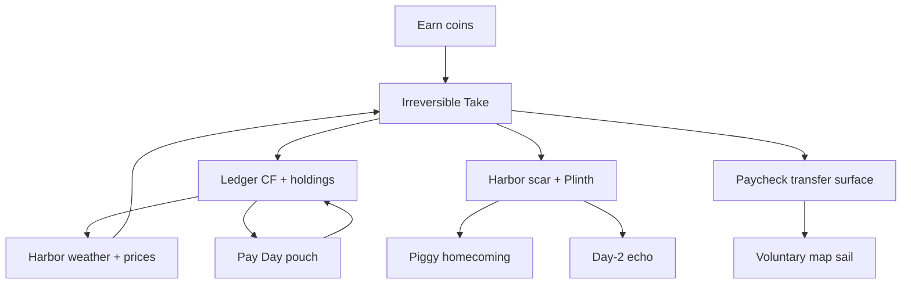

# Capital — Vertical Slice Gate

**Status:** Read-only audit — **one district** excellence gate before any world expansion  
**Audited slice:** **Harbor Memory Loop (HML)** — bounded, iconic-freeze compliant  
**Law:** **Do not expand the world** (no new districts, main-course islands, or map width) until this gate clears in **external playtesting**.  
**Date:** 2026-08-19  
**Evidence:** Repository @ `main` lineage · [CAPITAL_MASTER_AUDIT.md](./CAPITAL_MASTER_AUDIT.md) · [iconic-path.md](../iconic-path.md) · Pattern #94 **PENDING**

---

## 1. What is being audited?

Capital does not yet have fifteen excellent districts. It has **one candidate vertical slice** that must prove **genuine excellence** before width.

### Slice boundary (frozen)

| In scope | Out of scope (not required for this gate) |
|----------|-------------------------------------------|
| **Harbor Haven** — Castle Grounds plaza (home neighborhood) | Credit Kingdom · era side shores · Money Structure deep tours beyond teaser |
| **Coincraft Cove** — training Take (Money Carpet voyage) | New main-course islands |
| **Paycheck Peninsula** — transfer surface only (`ts_save_spend_pp_umbrella`) | Family Room backend · giant sim · LLM guide |
| Signature loop: Take → hush → spectacle → share → Piggy → day-2 echo | Board grind loop · Arcade · Studio · full Freedom Seal sim |

**One neighborhood:** **Harbor Haven** (`harbor_haven`) — fountain, Memory Plinth, Ledger Bank structure, carpet dock, quiet plaza rules.

**Linked shores** (Cove, Paycheck) are **authored voyage beats**, not second neighborhoods. They exist because transfer learning **requires** a materially different surface ([NORTH_STAR.md](../ftue/NORTH_STAR.md)) — not because the slice failed to stay local.

```
┌─────────────────────────────────────────────────────────┐
│  HARBOR MEMORY LOOP (vertical slice)                    │
│                                                         │
│  Harbor Haven (neighborhood)                            │
│       │ Money Carpet                                    │
│       ├────► Cove (training decision + consequence)     │
│       │         └──► return → scar spectacle            │
│       └────► Paycheck (transfer test — no Cove labels)  │
│                 └──► voluntary freedom on map           │
└─────────────────────────────────────────────────────────┘
```

**Expansion ban:** Until §6 gate clears, work is **deepen HML only** ([iconic-path.md](../iconic-path.md) freeze).

---

## 2. Required contents — audit checklist

Each row: **PASS** · **PARTIAL** · **FAIL** with repository evidence.

| Requirement | Verdict | Evidence |
|-------------|---------|----------|
| **3–5 memorable characters** | **PASS** | **Piggy Penny** (Harbor Keeper, homecoming) · **Coin Bag** (path buddy) · **Kira** (Cove Take) · **Vee** (Paycheck stall) · **Alma** (foreshadow) — cast in `moneyCast.ts`, talks in island JSON, `coldRetellLine` tests |
| **1 complete emotional story arc** | **PASS** | Mandatory beat chain in [CAPITAL_FIRST_HOUR.md](../ftue/CAPITAL_FIRST_HOUR.md): situation → Take → hush → spectacle → Piggy → transfer → freedom; Harmon circle for Harbor in [harbor-haven/story-circle.md](../islands/harbor-haven/story-circle.md) |
| **1 neighborhood** | **PASS** | Harbor Haven plaza craft, Plinth icon, quiet chrome rules, `WalkableHarborView` · [harbor-plaza-plan.md](../harbor-plaza-plan.md) |
| **1 economic cycle/shock** | **PARTIAL** | **Live:** CF → `harborWeatherMood` → shop multiplier (`harborWeather.ts`); Pay Day settlement (`applyPayday`); jar/treat holdings shock CF. **Gap:** `economy.ts` macro phase is **off-plaza**; no job/housing cycle — honest per [ECONOMIC_ENVIRONMENT_SYSTEM.md](../world/ECONOMIC_ENVIRONMENT_SYSTEM.md) |
| **6–8 interconnected financial primitives** | **PASS** | See §3 — eight primitives wired with cross-links |
| **Multiple viable strategies** | **PARTIAL** | Cove jar/treat: **INTERESTING** (identity) / CF-obvious ([DECISION_AUDIT.md](./DECISION_AUDIT.md) D-COVE). Paycheck: **MEANINGLESS for CF**, interesting for scar (D-PAY). Harbor deals: **OBVIOUS** Accept≫Pass (D-DEAL). Earn-first / skip-spend paths exist on Cove |
| **Persistent consequences** | **PASS** | `irreversibleChoices` · `harborScars` · `voyagerLedger` holdings · `chapterQuietPending` · stance · Plinth plaque · day-2 ritual |
| **Environmental economic storytelling** | **PARTIAL** | Sky/fog/prices bind to CF; Plinth/scar echo; **no** fake recession décor. Gap: weather audio layers TBD; macro must not contradict CF on plaza |
| **1 meaningful failure/recovery path** | **PASS** | Coin Sort / Ashore rings / quest fail dignity ([FAILURE_RECOVERY.md](../ftue/FAILURE_RECOVERY.md)); `failure_recovery_rate` instrumented; stay-put retry |
| **1 transfer-learning test** | **PARTIAL** | Scenario `ts_save_spend_pp_umbrella` + telemetry + `__QA__.seedIndependentTransfer()` — **human ITR unmeasured** ([INDEPENDENT_TRANSFER_PLAYTEST.md](../ftue/INDEPENDENT_TRANSFER_PLAYTEST.md) empty cohort) |
| **1 memorable emergent event** | **PARTIAL** | **Authored:** day-2 scar echo (`prepareDay2Echo`, Soft Beat cinema). **Emergent:** CF→weather→price interaction ([ANECDOTE_SYSTEM.md](../research/ANECDOTE_SYSTEM.md)). **Gap:** recall not validated — telemetry ≠ memorable |

### Checklist summary

| PASS | PARTIAL | FAIL |
|------|---------|------|
| 6 | 5 | 0 |

**Verdict:** HML is **machine-rich** and **emotionally authored**, but **not yet proven excellent** in external play on transfer, strategy depth, and emergent recall.

---

## 3. Financial primitives (8) — interconnection map

Primitives must **interact**, not merely co-exist.

| # | Primitive | HML expression | Connects to |
|---|-----------|----------------|-------------|
| 1 | **Earn then decide** | Cove First Coins → wallet → Take | Liquidity, session CF |
| 2 | **Save vs spend / protect vs shiny** | Jar vs treat · umbrella vs glitter | Scar, weather, transfer |
| 3 | **Irreversible Take** | `setIrreversible` + hush cinema | Memory, Plinth, quiet plaza |
| 4 | **Cashflow (/mo)** | Ledger holdings · `netCashflow` | Weather, Pay Day, Freedom chase |
| 5 | **Liquidity (pouch)** | EarnSpend “Not enough” · vendor prices | Deal accept/wait (Harbor) |
| 6 | **Income vs expenses** | Pay Day credit/debit | Escape streak |
| 7 | **Harbor memory** | Scar spectacle · Piggy line · day-2 echo | NPC tone, Family local myth |
| 8 | **Opportunity cost (felt)** | Fork blocks alternate plaque path | Transfer without labeling |



**Primitive gap:** **Wait vs commit** under scarcity is weak on Harbor deals (D-DEAL obvious) — recurring loop not part of HML gate but blocks “multiple viable strategies” from scoring 5.

---

## 4. Characters (memorable five)

| Character | Role in HML | Memory hook |
|-----------|-------------|-------------|
| **Piggy Penny** | Harbor Keeper; quiet homecoming | Names *your* plaque — living receipt |
| **Coin Bag** | Path buddy; points verbs not answers | Plinth / carpet / transfer silence |
| **Keeper Kira** | Cove Take host | Jar ritual vs treat — organ *holds* |
| **Vendor Vee** | Paycheck human situation | Rain + two prices — organ *shelters* |
| **Alma** | Foreshadow / stakes row | Preview literacy before commit |

Series terrace leads (Cashwell, etc.) are **explicitly offstage** during Piggy presence ([iconic-path.md](../iconic-path.md)).

---

## 5. Story arc (one complete emotional loop)

**Arc name:** *Harbor remembers what you chose.*

| Act | Beat | Emotion |
|-----|------|---------|
| I — Arrival | Ashore → Harbor meet → Cove earn | Curiosity, fair work |
| II — Commit | Kira Take | Tension, irreversibility |
| III — World answers | Hush → carpet → spectacle → share | Awe, “Harbor felt that” |
| IV — Relationship | Piggy homecoming | Attachment, named memory |
| V — Test | Paycheck Vee (no Cove labels) | Productive struggle |
| VI — Freedom | Map sail by choice | Agency, not homework |

**Complete?** **Yes** as authored cinema + character payoff. **Unproven?** Whether act V lands as **learning transfer** without hints (human cohort empty).

---

## 6. Dimension scores (1–5)

**Scale:** 1 = weak/absent · 3 = shippable machine-complete · 5 = external playtest excellence  
**Source split:** **Repo** = code/docs/tests · **Human** = Pattern #94 / ITR / anecdote recall (mostly **missing**)

| Dimension | Score | Repo | Human | Notes |
|-----------|------:|------|-------|-------|
| **FUN** | **3** | Signature loop QA + `test:iconic` green | #94 **PENDING** — “fun vs functional” unanswered at scale |
| **CURIOSITY** | **4** | Map unlock, side shores tease, Soft Beat, structures | Risk of early dilution if shores surface too soon |
| **AGENCY** | **4** | Real irreversible forks; voluntary continuation spec | Paycheck CF fork weakens *financial* agency (D-PAY) |
| **CAUSAL_CLARITY** | **4** | `feedbackLoopLine`, preview rows, Piggy because-lines | Paycheck CF residue **MEANINGLESS** weakens causal lesson |
| **CHARACTER_ATTACHMENT** | **5** | Piggy + Plinth + cold retell tests — strongest moat | External validation still sparse but evidence strongest here |
| **SYSTEMIC_DEPTH** | **3** | CF↔weather↔shop; scars↔quiet↔echo | Dual economy (`economy.ts` vs CF); deals non-interactive dominance |
| **FINANCIAL_LEARNING** | **3** | Pedagogy law + concept progression wired | ITR **unmeasured**; quiz paths demoted correctly |
| **TRANSFER** | **2** | Scenario + telemetry exist | **Zero** filled human cohort ([INDEPENDENT_TRANSFER_PLAYTEST.md](../ftue/INDEPENDENT_TRANSFER_PLAYTEST.md)) |
| **WORLD_MEMORY** | **5** | Scars, Plinth, day-2, Family local myth, gossip lines | Machine + content excellence; kid retell tests |
| **ANECDOTE_GENERATION** | **2** | Candidate events spec’d ([ANECDOTE_SYSTEM.md](../research/ANECDOTE_SYSTEM.md)) | No recall-validated density |
| **ACCESSIBILITY** | **4** | Reduced motion, mute-test chain, walk pad, Esc/Leave | Harbor FTUE replay partial (A14); load failsafes shipped |
| **TECHNICAL_STABILITY** | **4** | 642 tests; sanitize save; harbor load failsafe; iconic e2e | Human device matrix thin; remote sink missing |

### Foundational dimensions (expansion gate)

These **must reach ≥ 4/5 in external playtesting** before any world expansion:

| Foundational | Current (human-adjusted) | Blocker |
|--------------|--------------------------|---------|
| FUN | 3 | Need #94 “fun not only functional” ≥4/5 median |
| AGENCY | 4 | Hold — deepen Paycheck stakes not width |
| CAUSAL_CLARITY | 4 | Hold — fix Paycheck CF literacy if human confusion |
| FINANCIAL_LEARNING | 3 | ITR + principle retell |
| **TRANSFER** | **2** | **Primary gate — run n≥5 ITR cohort** |
| WORLD_MEMORY | 5 | Cleared |
| TECHNICAL_STABILITY | 4 | Cleared for slice scope |

**Weakest foundational dimension:** **TRANSFER (2/5)** — infrastructure without external proof.

**Secondary weak:** **FINANCIAL_LEARNING (3/5)**, **FUN (3/5)**, **ANECDOTE_GENERATION (2/5)** — anecdote is supporting, not expansion-blocking alone.

---

## 7. Gate verdict

### Is one district genuinely excellent?

| Question | Answer |
|----------|--------|
| Is HML **authored to excellence**? | **Yes** — signature loop, world memory, character attachment are flagship-grade in repo |
| Is HML **proven excellent with players**? | **No** — Pattern #94 / ITR / anecdote recall not executed |
| Is HML **mechanically closed**? | **Mostly** — transfer surface exists; Paycheck CF stakes and deal dominance weaken “multiple strategies” |
| May we **expand the world**? | **NO** |

```
┌────────────────────────────────────────┐
│  VERTICAL SLICE GATE:  NOT CLEARED     │
│  Weakest foundational: TRANSFER  (2/5) │
│  Required: external playtest ≥ 4/5     │
│            on all foundational dims      │
└────────────────────────────────────────┘
```

---

## 8. What to do instead of expanding (deepen HML)

Priority order — **no new districts/islands**:

| P | Action | Lifts |
|---|--------|-------|
| **P0** | Execute **Pattern #94** cold cohort (n≥5) + fill ITR log | TRANSFER, FINANCIAL_LEARNING, FUN |
| **P0** | Post-session: *“Tell me about the most memorable thing…”* vs telemetry | ANECDOTE_GENERATION |
| **P1** | Fix **Paycheck CF meaningfulness** (stakes visible in preview + Pay Day) — sim truth, not copy | CAUSAL_CLARITY, AGENCY, FINANCIAL_LEARNING |
| **P1** | Enforce **transfer silence** — Bag/Piggy/coach audit ([AI_GUIDE_GUARDRAILS.md](../ai/AI_GUIDE_GUARDRAILS.md)) | TRANSFER |
| **P2** | Harbor **deal non-dominance** when slice includes board beat ([STRONGEST_RECURRING_LOOP.md](./STRONGEST_RECURRING_LOOP.md)) | SYSTEMIC_DEPTH, multiple strategies |
| **P2** | Run **economic stress singles** on HML fixtures ([ECONOMIC_STRESS_TEST_PLAN.md](../qa/ECONOMIC_STRESS_TEST_PLAN.md)) | TECHNICAL_STABILITY |
| **P3** | Harbor FTUE replay accessibility (A14) | ACCESSIBILITY |

**Explicitly defer:** Credit as gate requirement · side shores · era districts · NPC economic books · map labels beyond triangle · Money Structure full interior tours as gate.

---

## 9. External playtest exit criteria (gate clear)

Re-audit scores only after a **non-designer cohort** (n≥5) on a **production-lock build** (`PLAYTEST_UNLOCK_ALL_ISLANDS = false`).

| Criterion | Pass threshold |
|-----------|----------------|
| **TRANSFER** | ITR ≥ agreed target (hypothesis: ≥60% unhinted on `save_vs_spend`) · dimension score **≥4** |
| **FINANCIAL_LEARNING** | ≥4/5 players cold-retell one organ sentence + one money rule | 
| **FUN** | ≥4/5 rate “fun” not “only functional” on #94 probe |
| **CAUSAL_CLARITY** | ≥4/5 explain Pay Day / weather change after Cove Take |
| **AGENCY** | ≥4/5 describe a choice *they* made, not a tutorial step |
| **Foundational floor** | **No foundational dimension below 4/5** in cohort rubric |
| **ANECDOTE** | ≥50% recall matches telemetry candidate (validated density) — supporting |

Until then: **iconic freeze holds** — deepen Plinth glow, transfer purity, Paycheck stakes, human proof.

---

## 10. Machine readiness (already green)

| Asset | Status |
|-------|--------|
| `npm run test:iconic` | Unit + content contracts |
| `npm run test:iconic:e2e` | Harbor/Cove smoke |
| Cold scripts | `cold-full-cove-chain.mjs`, `cold-human-triangle-pass.mjs`, … |
| QA seeds | `seedSignatureLoop`, `seedIndependentTransfer`, `prepareDay2Echo` |
| Telemetry | FTUE + concept transfer + health dashboard |
| Observer protocol | [FTUE_USABILITY_PROTOCOL.md](../ftue/FTUE_USABILITY_PROTOCOL.md) |

Machine readiness **does not clear** the vertical slice gate.

---

## 11. Anti-patterns (expansion blocked)

| Do not | Why |
|--------|-----|
| Add era side shores to “fix boredom” | Dilutes organ clarity before ITR proof |
| Ship Credit to “complete triangle” for gate | Gate is HML, not full spine |
| Add quizzes/XP to inflate learning scores | Violates constraint-play truth |
| Widen map because telemetry shows completion | Tutorial completion ≠ transfer |
| Fake housing/job/recession décor | Violates eco honesty |
| LLM guide to fix transfer | Spoils independent proof |

---

## 12. Document map

| Question | Read |
|----------|------|
| First hour beats | [CAPITAL_FIRST_HOUR.md](../ftue/CAPITAL_FIRST_HOUR.md) |
| ITR protocol | [INDEPENDENT_TRANSFER_PLAYTEST.md](../ftue/INDEPENDENT_TRANSFER_PLAYTEST.md) |
| Iconic freeze | [iconic-path.md](../iconic-path.md) |
| Decision weaknesses | [DECISION_AUDIT.md](./DECISION_AUDIT.md) |
| Master evidence | [CAPITAL_MASTER_AUDIT.md](./CAPITAL_MASTER_AUDIT.md) |
| Anecdote validation | [ANECDOTE_SYSTEM.md](../research/ANECDOTE_SYSTEM.md) |
| Learning metrics | [LEARNING_TRANSFER_FRAMEWORK.md](../research/LEARNING_TRANSFER_FRAMEWORK.md) |

---

## 13. Amendment rule

Update this gate when a human cohort completes with scored rubrics. Change scores only with **cited cohort id** and build SHA. Do not bump TRANSFER/FUN on QA scripts alone.

**Current gate status:** `NOT_CLEARED` · `HUMAN_ITR: PENDING` · `PATTERN_94: PENDING`
