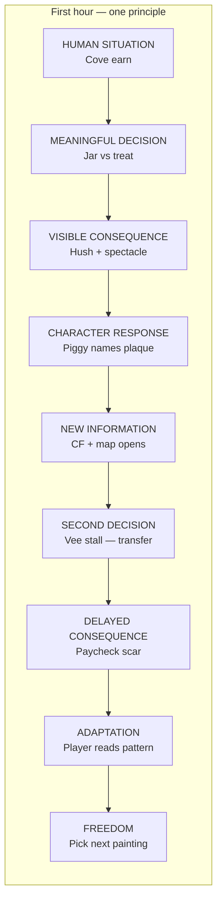

# Capital — First 45–60 Minutes

**Status:** Authoritative first-session design spec  
**Scope:** One human play arc from cold launch through **autonomy** (not full Freedom Seal — that is a medium-horizon sim proof).  
**Law:** Teach **one** financial principle through experience first; test the same reasoning later **without naming the concept**.  
**Beat chain (mandatory):**

```
HUMAN SITUATION
→ MEANINGFUL DECISION
→ VISIBLE CONSEQUENCE
→ CHARACTER RESPONSE
→ NEW INFORMATION
→ SECOND DECISION
→ DELAYED CONSEQUENCE
→ ADAPTATION
→ FREEDOM
```

**Companions:** [NORTH_STAR.md](./NORTH_STAR.md) · [FIRST_FINANCIAL_SCENARIO.md](./FIRST_FINANCIAL_SCENARIO.md) · [TRANSFER_TASKS.md](./TRANSFER_TASKS.md) · [AUTONOMY_PROGRESSION.md](./AUTONOMY_PROGRESSION.md) · [FTUE_TELEMETRY.md](./FTUE_TELEMETRY.md) · [INDEPENDENT_TRANSFER_PLAYTEST.md](./INDEPENDENT_TRANSFER_PLAYTEST.md) · [iconic-path.md](../iconic-path.md)

---

## 1. The one principle (first hour only)

### Principle (player-felt)

> **What you protect now is what you still have when something unexpected shows up.**

Not a glossary term. Not “emergency fund.” Not “save vs spend worksheet.” The player **feels** it as: *I kept something aside → the world stayed quieter / my cushion held → Harbor named that choice.*

### Canonical expression (design)

| Layer | Wording (internal) | Player must never hear in hour 1 |
|-------|-------------------|-----------------------------------|
| **Concept id** | `save_vs_spend` | “This is the save vs spend lesson” |
| **Organ verb** | Coin *holds* · Clock *shelters* | “You are a Saver class” |
| **Transfer id** | `ts_save_spend_pp_umbrella` | “Remember Cove? Pick umbrella like the jar” |

### Why this principle

- Fits the iconic spine: Cove jar/treat → Paycheck umbrella/glitter — **same rule, new surface** ([TRANSFER_TASKS.md](./TRANSFER_TASKS.md)).
- Produces **visible** consequences (scar, weather band, ledger holding) without a lecture.
- Transfers without button memory — Vee’s stall is a **rainy-day human situation**, not a recap modal.
- One principle only — Credit spiral, CF escape, and interest compounding are **hour-two+** concepts.

---

## 2. Beat chain — mapped to Capital

Each row is one link in the mandatory chain. Times are **targets** for a new Explorer-profile player (ages 6–10); Apprentice/Strategist may run faster.

| # | Chain link | Capital beat (shipped / specified) | Target time | Primary systems |
|---|------------|-----------------------------------|-------------|-----------------|
| 1 | **HUMAN SITUATION** | Title → Cast (look only) → Ashore chambers → Carpet → Harbor meet Piggy → voyage to **Coincraft Cove** → earn fair coins (jobs + craft) | 0:00–0:18 | `CapitalOpeningIntro` · `BootCastSelect` · Ashore teach · `hubGuidedIntro` · `first_cove_footprint` |
| 2 | **MEANINGFUL DECISION** | Keeper Kira **Take**: jar before treat **or** treat before jar (`cove_save_vs_spend`) — irreversible | 0:18–0:24 | Cove quest `q_cc_save_or_spend` · `setIrreversible` · `addScar` · ledger footprint |
| 3 | **VISIBLE CONSEQUENCE** | Take **hush** → carpet home → Harbor **scar spectacle** (Plinth glow, organ chime, sky band shifts) | 0:24–0:30 | `chapterQuietPending` · `take_mark` cinema · `harborScars` · `harborWeather` |
| 4 | **CHARACTER RESPONSE** | **Piggy Penny** quiet homecoming Talk — names *your* plaque in kid sentence (“Coin holds…” / treat gossip) | 0:30–0:34 | `harborHomecoming` · `coldRetellLine` · `piggyBondHomecomings` |
| 5 | **NEW INFORMATION** | Cashflow chip / weather + **Paycheck painting newly open** on map — curiosity, not homework | 0:34–0:38 | `voyagerLedger` holding · map unlock · Coin Bag line names *what opened*, not *what to pick* |
| 6 | **SECOND DECISION** | **Paycheck** — Vendor Vee’s stall: **umbrella before glitter** or **glitter ate the umbrella** — **no Cove mapping copy** | 0:38–0:50 | `q_pp_rainy_day` · `quest_pp_rainy_day` minigame · transfer surface |
| 7 | **DELAYED CONSEQUENCE** | Paycheck plaque + Harbor gossip + CF/weather residue; optional quiet homecoming echo | 0:50–0:55 | `pp_` scars · stance · delayed Pay Day feel on return |
| 8 | **ADAPTATION** | Player (not coach) connects pattern: protected thing vs shiny now — Piggy **may** name behavior, never assigns class | 0:55–0:58 | Emergent readout only · `stance` silent · no “correct answer” recap |
| 9 | **FREEDOM** | **Voluntary continuation** — map shows Paycheck + side shores; player picks next sail without forced arrow to “the lesson” | 0:58–1:00+ | `freeplay_entered` · side shores unlock · `autonomy_unlocked` on transfer pass |



---

## 3. Minute budget (45–60 min session)

Design targets — validate with human cohort; do not ship on tutorial-completion alone.

| Phase | Minutes | Player experience | Coach density |
|-------|---------|-------------------|---------------|
| **Launch & Ashore** | 0–8 | Fantasy, walk, talk, board Cove painting | High — one verb at a time |
| **Harbor meet** | 8–12 | Piggy wave; open map; first sail | Medium — meet → dock only |
| **Cove earn literacy** | 12–18 | First Coins: jobs, wallet, Coin Sort | Medium — fail-tier hints only after miss |
| **Cove Take (training)** | 18–24 | Alma foreshadow → Kira Take commit | Low on labels — foreshadow rows carry stakes |
| **Signature loop close** | 24–34 | Hush → home → spectacle → Piggy Talk | Silent HUD until Piggy |
| **Bridge & transfer setup** | 34–38 | Map: Paycheck unlocked; CF/weather readable | **Silent** — no “go apply the jar” |
| **Paycheck transfer** | 38–50 | Rainy park → Vee two prices | Fail-tier only; **no concept name** |
| **Freedom & curiosity** | 50–60+ | Choose next island; side shores tease; ritual optional | Stage 6 — normal Capital verbs |

**Hard ceiling:** If the player has not reached **FREEDOM** (voluntary map sail) by **60 minutes**, the session failed the hour spec — shorten Ashore or earn chain, do not add quizzes.

---

## 4. Beat specifications

### 4.1 HUMAN SITUATION (0:00–0:18)

**Human problem:** You washed ashore with nothing settled. Fair work earns coins, but something soon will ask you to choose between **keeping** money and **spending** it on something shiny.

| Requirement | Capital expression |
|-------------|-------------------|
| Emotional stake | Piggy as Harbor Keeper; Coin Bag points at Cove painting — not a tutorial menu |
| Financial stake | Empty wallet → earn → insufficient spend rejects for real (`EarnSpendModule`) |
| No personality quiz | Cast select = **look only** — no “pick Saver / Spender” |
| One coach voice | Ashore + Piggy only in first 12 min ([Complexity Cut](../design/CAPITAL_MASTER_AUDIT.md)) |

**Valid paths:** Ashore Esc skip → Harbor walk; experienced boot → shorter Ashore; fail Coin Sort → retry stay-put.

**Non-goals:** Outfitter gate · Capsule required buy · Harbor board · Arcade · Studio · wealth rank ladder.

---

### 4.2 MEANINGFUL DECISION (0:18–0:24)

**Decision:** Jar before treat **or** treat before jar — both valid, both irreversible.

| Field | Spec |
|-------|------|
| **Fork shape** | Protect cushion vs spend-now treat |
| **Information before commit** | Short foreshadow on choice rows — Harbor mood, not loot comparison |
| **Deferral** | “Maybe later” OK — delays loop, does not fail hour |
| **Simulation** | `setIrreversible` + `addScar` + ledger holding (asset vs liability footprint) |

**Unlock test:** *What new decision does this allow?* → Live with a **monthly cushion shape** the world will reference.

**Telemetry:** `decision_presented` (via `first_decision_marker` on Kira) → `decision_committed`.

---

### 4.3 VISIBLE CONSEQUENCE (0:24–0:30)

**Consequence must be seen and heard without opening a stats screen.**

| Channel | Saver path (jar) | Spender path (treat) |
|---------|------------------|----------------------|
| **Immediate** | Take hush · quieter shore | Take hush · brighter treat residue |
| **Harbor** | Plinth plaque · Memory organ glow | Plinth plaque · louder gossip tone |
| **Simulation** | Cove Jar Hold (+$/mo asset) | Cove Treat Tab (−$/mo liability) |
| **Sky** | Calmer band when CF positive | Thinner band / fog bias when CF strained |

**Player interpretation target:** *“Harbor felt that — I can see which way I leaned.”*

**Telemetry:** `consequence_displayed` (via `first_consequence_marker` on hush / `harbor_felt`).

---

### 4.4 CHARACTER RESPONSE (0:30–0:34)

**Character:** Piggy Penny — relationship anchor, not quiz NPC.

| Beat | Copy law |
|------|----------|
| Welcome back | Names **your** plaque verb (“Coin holds — jar before treat”) |
| No lecture | One kid sentence + optional organ chip |
| No judgment class | Warm on either path — differ in **tone**, not worth |
| Attachment signal | Player chooses to Talk Piggy again voluntarily |

**Anti-pattern:** Piggy explaining APR, budget buckets, or “you should have picked jar.”

**Telemetry (design):** `first_meaningful_action` with `npc:piggy_penny` talk after homecoming → **`time_to_first_character_attachment`** (see §6).

---

### 4.5 NEW INFORMATION (0:34–0:38)

**New info is world state, not a slide deck.**

| Information | How player learns it | Forbidden |
|-------------|---------------------|-----------|
| Monthly cushion changed | CF chip / holding line on ledger | “Your net worth went up 10%” |
| Harbor remembers | Plinth + Piggy line already seen | Achievement badge popup |
| **New place** | Paycheck painting **visible** on map | Arrow: “Go do the same thing here” |
| Side shores exist | Map ring tease after Paycheck Change | Required side quest |

Coin Bag may say *“Paycheck Peninsula is newly open on the Carpet”* — **never** *“Apply your Cove answer at Vee’s stall.”*

**Concept phase:** `save_vs_spend` → `REDUCED_GUIDANCE` or `INDEPENDENT` window opens on Paycheck discover ([conceptProgression/registry.ts](../../src/islands/conceptProgression/registry.ts)).

---

### 4.6 SECOND DECISION — transfer (0:38–0:50)

**Human situation (new):** Rain broke the fountain. Vendor Vee sells a **shelter kit** and **half-off glitter** — same human tension, new nouns.

| Transfer law | Implementation |
|--------------|----------------|
| Same underlying rule | Protect before shiny spend |
| New surface | Paycheck stall · rainy-day park · Clock organ |
| New numbers | Different $ amounts · different item ids |
| No tutorial chrome | No Cove module labels · no “Chapter 2 recap” |
| No optimal reveal on attempt 1 | Fail-tier hints only ([FAILURE_RECOVERY.md](./FAILURE_RECOVERY.md)) |

**Valid strategies:** Umbrella first · glitter first · earn-more-first if wallet thin · defer.

**Independent transfer success:** Commits Vee Take **without** observer saying “like the jar” or opening tutorial replay ([INDEPENDENT_TRANSFER_PLAYTEST.md](./INDEPENDENT_TRANSFER_PLAYTEST.md)).

**Telemetry:** `transfer_started` on Paycheck stall present → `transfer_success` on irreversible commit.

---

### 4.7 DELAYED CONSEQUENCE (0:50–0:55)

**Delay** separates training from transfer — player feels Paycheck **after** Harbor already stamped Cove.

| Delayed effect | Examples |
|----------------|----------|
| Paycheck scar on Plinth / gossip | `pp_umbrella_*` / `pp_glitter_*` |
| Combined CF story | Two footprints → weather band |
| Return Harbor echo | Day-2 style rumor if session continues |

Not required in hour 1: Freedom Seal · Credit unlock · three Pay Day streak.

---

### 4.8 ADAPTATION (0:55–0:58)

**Adaptation = player revises strategy without a coach naming the rule.**

| Signal adaptation worked | Signal it failed |
|---------------------------|------------------|
| Player articulates “I kept X before Y” in own words | Asks “what was the right answer at Cove?” |
| Chooses third sail based on curiosity | Waits for flashing quest arrow |
| Piggy emergent tag optional (“Holder”) | Opens mastery worksheet before second painting |

**Stance** (`saver` / `spender` / `risk`) updates silently — **never** shown as RPG bars in hour 1.

---

### 4.9 FREEDOM (0:58–1:00+)

**Freedom in hour 1 = autonomy, not Freedom Seal.**

| Freedom means | Freedom does **not** mean |
|---------------|---------------------------|
| Map open · pick next painting voluntarily | Quiz gate cleared |
| Coach indistinguishable from normal verbs | All islands unlocked |
| Side shores discoverable · optional | Grind for carpet tier |
| `freeplay_entered` fires | Mastery ×3 for Credit |

**Curiosity hooks (optional, non-blocking):** Soft Beat peek · Shelly digression · Giant Coin Jar · Harbor ritual rumor.

**Medium horizon (post-hour):** Harbor deals → CF chase → Freedom Seal → Credit ([PROGRESSION_AUDIT.md](../design/PROGRESSION_AUDIT.md)).

---

## 5. Training vs transfer (same principle, two situations)

| | **Training (Cove)** | **Transfer (Paycheck)** |
|--|---------------------|-------------------------|
| **Human situation** | Earned fair coins; lighthouse keeper offers jar ritual vs treat | Rain broke fountain; vendor sells shelter vs glitter deal |
| **Decision** | Jar before treat / treat before jar | Umbrella before glitter / glitter ate umbrella |
| **Visible consequence** | Cove hush + Harbor spectacle | Paycheck scar + gossip + CF residue |
| **Character** | Kira + Piggy | Vee + Piggy (on return) |
| **Concept named?** | **Never** “save vs spend” | **Never** “remember Cove” |
| **Scenario id** | `first_cove_footprint` | `ts_save_spend_pp_umbrella` |

---

## 6. Measurement framework

### 6.1 Required metrics (first hour cohort)

| Metric | Definition | Telemetry anchor | Hour-1 design target* |
|--------|------------|------------------|------------------------|
| **`time_to_first_decision`** | Elapsed ms to first `decision_presented` (Kira Take) | `decision_presented` · payload `via: first_decision_marker` | **12–22 min** (Explorer); ≤15 min experienced |
| **`time_to_first_consequence`** | Elapsed ms to first `consequence_displayed` (hush / Harbor felt) | `consequence_displayed` · `first_consequence_marker` | **18–28 min** |
| **`time_to_first_character_attachment`** | Elapsed ms to first voluntary **Talk** with Piggy after `meet_guide` (excluding forced Ashore ring talk) | `first_meaningful_action` · `npc:piggy_penny` · or homecoming `piggyTalked` | **8–15 min** |
| **`time_to_first_complete_financial_loop`** | Elapsed ms to first full **earn → decide → consequence** cycle (Cove Change complete) | `consequence_displayed` at Cove loop **or** `tutorial_completed` first quest · maps to `time_to_first_core_loop_ms` | **28–38 min** |
| **`hint_usage`** | Share of sessions with `hint_used` or `hint_requested` before first `transfer_success` | `hint_used` · `hint_requested` · aggregate `hint_dependency` | **< 40%** sessions pre-transfer |
| **`transfer_success`** | Binary: Vee Take committed without hinted mapping | `transfer_success` · concept `save_vs_spend` · scenario `ts_save_spend_pp_umbrella` | **King KPI** — cohort `n ≥ 5` human ([INDEPENDENT_TRANSFER_PLAYTEST.md](./INDEPENDENT_TRANSFER_PLAYTEST.md)) |
| **`voluntary_continuation`** | Session reaches `freeplay_entered` **and** player-initiated voyage to Paycheck or side shore without quest waypoint click | `freeplay_entered` + `decision_committed` on Paycheck **or** `discovered.islands` adds non-Cove id | **≥ 70%** of transfer-success sessions |

\*Targets are **hypotheses** until human playtest fills [usability cohort logs](./usability/cohorts/README.md). Do not ship tutorial-completion bumps as wins.

### 6.2 Event checklist (minimum viable hour-1 trace)

```
ftue_started
first_control_received
first_meaningful_action          → character attachment
concept_introduced (save_vs_spend)
decision_presented               → time_to_first_decision
decision_committed
consequence_displayed            → time_to_first_consequence / core_loop
concept_practiced
transfer_started
transfer_success | transfer_failure
hint_offered | hint_used         → hint_usage
autonomy_unlocked | freeplay_entered → voluntary_continuation
session_ended
```

### 6.3 King KPI (session success)

**Independent Transfer Rate** for `save_vs_spend` in the first hour:

> After Cove teaches *protect before shiny spend*, what % of players commit a Paycheck Vee Take **without being told** it is the same lesson?

Tutorial completion is **diagnostic only** ([NORTH_STAR.md](./NORTH_STAR.md)).

### 6.4 What we do not optimize in hour 1

| Metric | Why demoted |
|--------|-------------|
| Tutorial completion rate alone | Button memory |
| Mastery quiz clears | Worksheet digression |
| Pouch total / wealth rank | Currency inflation |
| Time to Freedom Seal | Medium horizon — not hour 1 |
| Side shore completion count | Collection, not principle |

---

## 7. Content & systems boundaries

### In scope (hour 1)

| System | Role |
|--------|------|
| Ashore + `hubGuidedIntro` | Verb literacy |
| `first_cove_footprint` | Earn → decide |
| Cove Change quest | Training decision |
| Signature loop (hush → spectacle → Piggy) | Consequence + character |
| Paycheck `q_pp_rainy_day` / Vee | Transfer decision |
| `voyagerLedger` footprint | Honest CF |
| Map unlock (Paycheck + side shores) | Freedom |

### Out of scope (defer)

| System | Reason |
|--------|--------|
| Harbor deals / Freedom Seal chase | Medium horizon — needs repeated Pay Days |
| Credit Kingdom | Third organ — new principle |
| Mastery gates (worksheets) | Optional digression |
| Arcade / Studio / Party board grind | Busywork in hour 1 |
| Era side shore **main** quests | Discovery only |
| Budget buckets side quest (`q_pp_budget_basics`) | **After** Vee Take — new concept (Clock), not hour-1 principle |
| Wealth rank / XP / skillStats | Hollow progression |

---

## 8. Failure recovery (hour 1)

| Failure | Response | Must not |
|---------|----------|----------|
| Broke spend on Cove | Real reject + earn more | Grant tutorial coins |
| Coin Sort fail | Stay on shore · fail-tier hint | Skip to Take |
| Kira “Maybe later” | Return when ready | Hard lock map |
| Ashore Esc skip | Harbor still teaches walk/talk | Brick the save |
| Transfer stall confusion | Attempt ≥2 conceptual hint | Reveal “pick umbrella like jar” |
| Quit before Vee | Save retains Cove scar · Paycheck still valid next session | Punish deferral |

See [FAILURE_RECOVERY.md](./FAILURE_RECOVERY.md) · [FTUE_ACCESSIBILITY_AUDIT.md](./FTUE_ACCESSIBILITY_AUDIT.md).

---

## 9. Success criteria

### Player (cold retell, no glossary)

After 45–60 minutes, a new player should be able to say something like:

> *“I earned money, then I chose to keep some or spend on something fun. Harbor showed it on the plaque. Later at the rainy stall I had to choose again — shelter or glitter — and it felt like the same kind of choice.”*

They should **not** need to say “save vs spend,” “emergency fund,” or “transfer task.”

### Design (Constitution test)

- [ ] Exactly **one** primary principle taught through experience  
- [ ] Second situation tests same reasoning **without concept label**  
- [ ] Every beat in the mandatory chain is present and ordered  
- [ ] Identity emerges from Takes — no financial personality menu  
- [ ] Hour ends in **FREEDOM** (voluntary navigation), not quiz gate  
- [ ] All money rules = production modules (no parallel tutorial wallet)  

### Ship question

Does this hour raise **`transfer_success` / Independent Transfer Rate** without increasing **`hint_usage`** or **`time_to_first_decision`** beyond targets?

If it only speeds tutorial completion — **do not ship as a win**.

---

## 10. Repository anchors

| Piece | Path |
|-------|------|
| First financial scenario | `docs/ftue/FIRST_FINANCIAL_SCENARIO.md` · `src/islands/firstFinancialScenario.ts` |
| Cove content | `src/islands/content/coincraft-cove.islands.json` |
| Paycheck transfer | `src/islands/content/paycheck-peninsula.islands.json` · `transferTasks.ts` |
| Signature loop | `docs/iconic-path.md` · `IslandsApp` homecoming chain |
| Gates | `src/islands/progressGates.ts` · `chapterLoop.ts` |
| FTUE telemetry | `src/islands/analytics/ftue/` |
| Progression contract test | `src/islands/views/progressionContract.test.ts` |
| Human ITR protocol | `docs/ftue/INDEPENDENT_TRANSFER_PLAYTEST.md` |

---

## 11. Anti-patterns (instant fail)

| Anti-pattern | Why |
|--------------|-----|
| “Pick your money personality” at cast | Identity before behavior |
| Piggy: “Now apply what you learned at Cove” | Breaks transfer |
| Quiz before Paycheck sail | Mastery inflation |
| Forcing jar as correct | Fake trade-off |
| Feature tour of plaza before Take | Delays first decision |
| Board Stars / XP / wealth rank celebration | Hollow progression |
| Opening Credit in hour 1 | Second principle too soon |
| Showing `%` buff for “being a saver” | Pay-to-identity |

---

*Design spec only — no production code changed in this document.*
