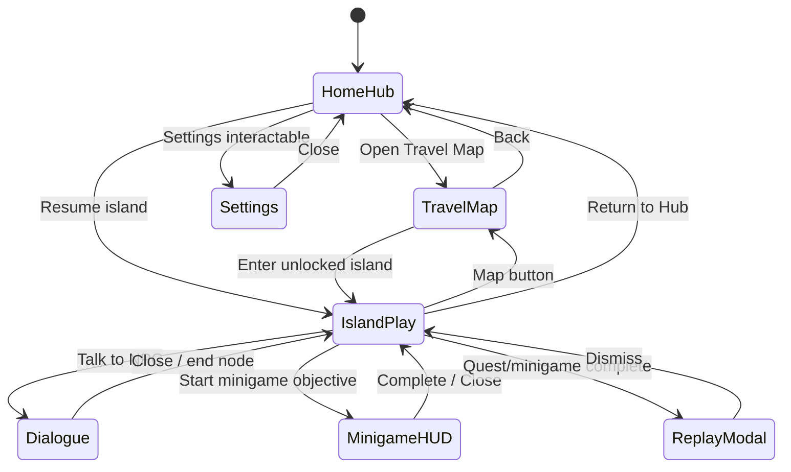

# FinanceQuest Islands — UI/UX Style Guide & Component Spec

**Scope:** Islands mode surfaces (Hub, Travel, Island play, overlays).  
**Related:** [game-pillars.md](./game-pillars.md) · `src/islands/IslandsApp.tsx` · `src/islands/settings.ts` · `src/styles/retro-coolmath.css`

---

## 1. Design philosophy

### North star
**Adventure UI, not spreadsheet UI.** Players should read the world like a cozy RPG or educational adventure (Poptropica / Coolmath energy), not a fintech dashboard. Learning happens in **menus and overlays**; the world stays calm.

### Inspiration sources (how to use them)

| Source | URL | Use for |
|--------|-----|---------|
| **Interface In Game** | [interfaceingame.com](https://interfaceingame.com/) | Screenshot refs by **element**: [Map](https://interfaceingame.com/elements/map/), [Quest](https://interfaceingame.com/elements/quest/), [Dialogue](https://interfaceingame.com/elements/dialogue/), [Inventory](https://interfaceingame.com/elements/inventory/), [Settings](https://interfaceingame.com/elements/settings/), [Tutorial](https://interfaceingame.com/elements/tutorial/), [Overlay](https://interfaceingame.com/elements/overlay/), [Progress](https://interfaceingame.com/elements/progress/). Filter **Adventure / RPG / Puzzle** genres for tone. |
| **Game UI Database** | [gameuidatabase.com](https://www.gameuidatabase.com/) | Genre comps: cozy hub (**Animal Crossing** menu density), world map (**Zelda: BOTW** pin clarity), quest tracker (**Spiritfarer** / **Hades** bounties), dialogue (**Undertale** / **Night in the Woods** choice stacks), inventory (**Stardew Valley** grid), settings (**Celeste** accessibility-first). |
| **General game UI practice** | — | Separate **HUD** (persistent, glanceable) from **menus** (modal, focusable). One primary action per screen. Feedback within 100–300ms. Never block learning with tiny type or motion-only cues. |

### Visual identity (Islands)

| Token | Value | Notes |
|-------|--------|------|
| **Mood** | Sky → meadow gradient, white “card islands,” emoji icons | Matches `IslandsApp` hub/travel |
| **Chrome** | `bg-white/90 backdrop-blur` panels, `rounded-xl`, `shadow-lg` | Readable on busy backgrounds |
| **Accent** | Sky blue `#3498db`, emerald `#2ecc71`, amber `#f39c12` | From `retro-coolmath.css` |
| **Type** | System UI stack + `font-black` display, `font-bold` labels | Avoid Comic Sans in production; keep retro *weight*, not font |
| **Motion** | Framer: fade + subtle scale; hub hover lift | Respect `motion-reduce` |

---

## 2. UI hierarchy map (what shows when)

### Layer stack (z-index)

| z | Layer | Blocks input? | Examples |
|---|--------|---------------|----------|
| **0** | World / page background | No | Gradients, clouds, ground curve |
| **10** | Persistent HUD | No | Player chip, profile badge, area badge |
| **20** | Primary content | Partial | Explore grid, quest column, inventory strip |
| **40** | Secondary panels | Partial | Skill stats (compact), economy weather |
| **50** | **Modal overlays** | Yes | Dialogue, minigame, hub modals, settings |
| **60** | System | Yes | Replay (“Why it happened”), dev cheats |

### View state machine



### What is visible per view

| View | Always visible | Hidden / suppressed |
|------|----------------|---------------------|
| **Home Hub** | Player HUD, profile badge, Exit, 4 interactables, primary CTA | Quest log, area list, inventory detail |
| **Travel Map** | Player HUD (simplified), Back, island pins | Quest log, NPC list, minigame |
| **Island Play** | Island header, area badge, Map + Hub nav, Explore + Quest column, Inventory | Full-screen dialogue/minigame until triggered |
| **Dialogue** | Dim scrim + dialogue card only | Explore interactions (blocked) |
| **Minigame HUD** | Dim scrim + minigame card | Island layout behind scrim |
| **Settings** | Modal over current view | — |

### HUD vs menu rule

| Type | Definition | Islands examples |
|------|------------|------------------|
| **HUD** | Always on, low detail, no focus trap | Player chip (name, level, coins/XP), current area badge, difficulty pill in minigame |
| **Menu** | Opens on intent, focus trapped, dismissible | Dialogue, minigame, settings, hub Character/Shop/Arcade modals |
| **Diegetic** | Feels “in world” | Travel map pins, hub interactable buildings |
| **Meta** | Progress / learning | Quest log, skill stats, replay modal |

---

## 3. Typography, spacing & animation

### Typography scale

Base uses fluid tokens from `main.css` (`--font-size-*`). Islands root applies `textSizeClass()` — **all specs below assume `normal`**; scale ×1.125 for `large`, ×1.25 for `xl`.

| Role | Element | Size (normal) | Weight | Line height | Max width |
|------|---------|---------------|--------|-------------|-----------|
| **Display** | Hub / map titles | `text-4xl` (clamp via `--font-size-2xl` on sm+) | `font-black` | 1.1 | — |
| **H1** | Island name | `text-3xl` | `font-black` | 1.2 | — |
| **H2** | Section (Explore, Quest Log) | `text-lg` | `font-bold` | 1.3 | — |
| **H3** | Card title / NPC name | `text-base` | `font-bold` | 1.4 | — |
| **Body** | Descriptions, dialogue | `text-base` | `font-normal` | 1.5 | `max-w-prose` (dialogue) |
| **Caption** | Hints, progress %, meta | `text-xs`–`text-sm` | `font-medium` / `italic` for hints | 1.4 | — |
| **HUD** | Player chip secondary | `text-sm` | `font-normal` | 1.3 | — |
| **Minigame stat** | Score bar | `text-sm` | `font-semibold` | 1.3 | — |
| **Module label** | Panel header | `text-sm` uppercase | `font-bold` | 1.2 | — |

**Rules**
- Dialogue body: **≥ 16px** effective (`text-base` minimum).
- Quest “Next” callout: `text-xs font-medium` but **≥ 4.5:1** contrast on tinted bg.
- Numbers: use tabular figures where aligned (`font-variant-numeric: tabular-nums` on coin/XP rows).
- Learning profile adjusts **copy**, not display size alone (`resolveProfileText`).

### Spacing system

Use CSS variables where possible; Tailwind mapping for Islands:

| Token | CSS var | Tailwind | Use |
|-------|---------|----------|-----|
| **xs** | `--space-xs` | `gap-1` `p-1` | Icon gaps, tight lists |
| **sm** | `--space-sm` | `gap-2` `p-2` | Choice buttons, inventory cells |
| **md** | `--space-md` | `gap-3` `p-4` | Card content default (`CardContent p-4`) |
| **lg** | `--space-lg` | `gap-4` `p-6` | Section separation, modal padding |
| **xl** | `--space-xl` | `mt-10` `px-6` | Hub vertical rhythm |

**Layout grids**
- Island play: `grid-cols-1 lg:grid-cols-3` — Explore **2/3**, Quest Log **1/3**.
- Inventory: `grid-cols-1 sm:grid-cols-2 lg:grid-cols-3`.
- Minigame modules: `grid gap-4 md:grid-cols-2`.
- Touch targets: **min 44×44px** (`min-h-11` on primary buttons).

**Radii & borders**
- Cards: `rounded-lg` / Card default `--radius`.
- Hub interactables: `rounded-2xl` + `border-4` color-coded.
- Island pins: `rounded-2xl` `w-20 h-20`.

### Animation rules

| Context | Default | Reduced motion (`motion-reduce`) |
|---------|---------|----------------------------------|
| View transition | `opacity` 200–300ms | Instant cut, no slide |
| Hub interactable hover | `scale 1.08`, `y: -4` | Outline/focus ring only |
| Modal enter | `opacity` + `scale 0.9→1` or `y: 40→0` (dialogue) | Fade only ≤ 150ms or none |
| Travel clouds | Infinite linear drift | **Static** or hidden |
| Reward moment | Brief scale pulse on badge | Text + SFX only |
| Toast (minigame message) | Slide/fade in | Appear instantly, no auto-dismiss animation |

**Timing**
- Feedback: **100–150ms** (button press).
- Panel open: **200–300ms**.
- Celebration: **400–600ms** max; never block input > 1s without skip.

**Easing:** `cubic-bezier(0.4, 0, 0.2, 1)` (Material standard); bouncy springs **off** for teens/adult profile, optional for elementary hub only.

---

## 4. Accessibility rules

Implemented via `AccessibilitySettings` + root classes on `IslandsApp`.

| Setting | Implementation | Requirement |
|---------|----------------|---------------|
| **Text size** | `normal` \| `large` \| `xl` → `textSizeClass` on root | All body/UI text scales; icons may stay fixed |
| **Reduced motion** | `motion-reduce` on root; disable Framer hover loops | No infinite anim; modals fade only |
| **High contrast** | `contrast-more` on root | Text **≥ 7:1** on panels; borders visible (`border-2`) |
| **Focus** | Visible ring on all interactive elements | WCAG 2.4.7; tab order: header → content → overlays |
| **Screen reader** | `aria-pressed` on profile/settings; `role="radiogroup"` text size | Quest tracker: `aria-label="Quest progress"` region |

**Contrast minimums (normal mode)**

| Pair | Minimum |
|------|---------|
| Body on white/90 panel | 4.5:1 |
| Captions / muted | 4.5:1 (no lighter than `text-muted-foreground` on white) |
| Primary CTA | 4.5:1 text + 3:1 component boundary |
| Dialogue scrim | N/A; card text must pass on **opaque** card bg |

**Do not**
- Rely on color alone for quest state (use ✅ / ⬜ + text).
- Use motion as the only success/fail signal (pair with SFX + copy).
- Auto-play video tutorials with sound.

**System prefs:** Honor `prefers-reduced-motion` in CSS even if user hasn’t toggled in-game (mirror to `reducedMotion` default suggestion on first run — future).

---

## 5. Component specifications

### 5.1 Home Hub

**Reference comps:** Interface In Game → [Lobby](https://interfaceingame.com/elements/lobby/), [Start screen](https://interfaceingame.com/elements/start-screen/), [Menu](https://interfaceingame.com/elements/menu/). Game UI Database → cozy hub menus (low density).

| Part | Spec |
|------|------|
| **Layout** | Full viewport; sky gradient + ground curve (`h-1/3`); content `z-10`–`z-20` |
| **Player HUD** | Top bar: name `font-bold`, stats row per `hudMode` (simplified = level only) |
| **Title** | Centered display “Home Hub”; white + drop shadow for legibility |
| **Interactables** | 4× `w-24 h-28` cards, `border-4` color token (amber/violet/rose/slate), emoji `text-5xl`, label below |
| **Primary CTA** | `Button size="lg"` — “Open Travel Map”; single focal action |
| **Secondary** | Resume island if save exists; dev editor badge DEV only |
| **States** | Default; hover lift (unless reduced motion); modal open dims `bg-black/50` |

**Hub modals (Character / Shop / Arcade / Settings)**
- `max-w-md` centered card; click-outside dismiss.
- Settings embeds full `SettingsPanel` (no duplicate Close in footer).

---

### 5.2 Travel Map

**Reference comps:** [Map](https://interfaceingame.com/elements/map/), [Level selection](https://interfaceingame.com/elements/level-selection/). BOTW-style pin clarity at a glance.

| Part | Spec |
|------|------|
| **Layout** | Full screen; decorative clouds `pointer-events-none` (disable when reduced motion) |
| **HUD** | Top: player chip + Back (outline, white/90) |
| **Title** | Centered “Travel Map”; heavy outline shadow for sky contrast |
| **Island pin** | `w-20 h-20` tile, `text-4xl` icon; label pill below (`text-xs font-bold`) |
| **Locked** | `opacity-50`, grayscale, 🔒 icon, `cursor-not-allowed`, tooltip with required items |
| **Unlocked** | Hover `scale 1.12`; click → `enterIsland` |
| **Position** | Percent-based map coords (document in island content spec); min spacing to avoid overlap on mobile |

**Feedback:** `title` attribute for lock reason; future: toast on locked tap (“Need Coin Pouch”).

---

### 5.3 Quest Log / Roadmap

**Reference comps:** [Quest](https://interfaceingame.com/elements/quest/), [Progress](https://interfaceingame.com/elements/progress/). Hades-style “next step” highlight.

| Part | Spec |
|------|------|
| **Container** | Right column `Card`; section title “Quest Log” |
| **Quest card** | `border rounded-lg p-3 bg-white/60` per quest |
| **Header** | Title `font-bold` + description `text-sm muted` + status `Badge` (Done / In progress / Not started) |
| **Objectives** | List with ✅ / ⬜; labels human-readable (NPC/item/minigame names) |
| **Next step** | Blue callout `➡️ Next: …` when started && !completed |
| **Hints** | Amber callout after fail; escalated hint at ≥2 fails |
| **Progress** | `Progress: N%` caption |
| **Actions** | `Start` only when not started; no manual complete in prod |

**Roadmap (future):** Horizontal stepper above log for linear tutorial island; same objective data, visual connector between steps.

---

### 5.4 Dialogue

**Reference comps:** [Dialogue](https://interfaceingame.com/elements/dialogue/), [Character](https://interfaceingame.com/elements/character/). Bottom-anchored on mobile, centered on `sm+`.

| Part | Spec |
|------|------|
| **Overlay** | `fixed inset-0 z-50 bg-black/60`; dismiss on scrim click |
| **Panel** | `max-w-2xl`; mobile `items-end` (bottom sheet feel) |
| **Speaker** | `font-bold` top line |
| **Body** | `resolveProfileText`; `text-base`, comfortable padding |
| **Choices** | Full-width stacked `Button variant="secondary" justify-start`; min 44px height |
| **Locked choice** | 🔒 prefix + `disabled` + `title` requirements |
| **End node** | Single full-width Close |
| **Effects** | No visual spam; quest start via dialogue effects → quest log updates on close |

**Juice (optional):** Typewriter text **off** by default (a11y); short fade-in per line acceptable.

---

### 5.5 Inventory

**Reference comps:** [Inventory](https://interfaceingame.com/elements/inventory/). Stardew-style icon + name + flavor text.

| Part | Spec |
|------|------|
| **Placement** | Full-width card below Explore/Quest grid |
| **Empty** | Friendly one-liner `text-sm muted` |
| **Item cell** | `flex gap-2 border rounded-lg px-3 py-2 bg-white/60` |
| **Icon** | `text-xl` emoji or asset |
| **Text** | Name `font-bold text-sm truncate`; description `text-xs muted truncate` |
| **Actions** | Collect happens in “Items here” explore card; inventory is **read-only** display |
| **Gates** | Items required for areas show in explore, not inventory actions |

**Future:** Detail popover on click; equip slot for cosmetics only (no pay-to-win stats).

---

### 5.6 Minigame HUD

**Reference comps:** [In game](https://interfaceingame.com/elements/in-game/), [Overlay](https://interfaceingame.com/elements/overlay/), [Game over](https://interfaceingame.com/elements/game-over/).

| Part | Spec |
|------|------|
| **Shell** | `fixed inset-0 z-50 bg-black/70`; `max-w-3xl` card; scroll allowed on small screens |
| **Header** | Title + icon; description muted; Close `✕` top-right (confirm if mid-run — future) |
| **Score bar (HUD)** | Single row: money, score, turn/max, difficulty — `bg-gradient-to-r from-blue-50 to-purple-50 rounded-xl` |
| **Toasts** | Max 5 visible; variant colors: success/warning/error/info; auto-dismiss 3s |
| **Module panels** | `border rounded-xl p-4 bg-white shadow-sm`; label uppercase `text-sm` |
| **Actions** | Primary actions per module; disabled when `gameOver` |
| **Complete state** | Green panel, final score, **Finish** CTA → `onComplete` |

**Rules**
- Keep **one** primary action per module panel visible without scroll on 768px height.
- Score changes: flash number or toast, not both (reduced noise).
- Difficulty shown but not editable mid-run.

---

### 5.7 Settings

**Reference comps:** [Settings](https://interfaceingame.com/elements/settings/). Celeste-style clarity: labels + consequences explained.

| Part | Spec |
|------|------|
| **Entry** | Hub interactable → modal; also reachable from island header (future gear icon) |
| **Sections** | Learning Profile (radio cards) · Accessibility · (future: Audio) |
| **Profile card** | `border-2 rounded-xl p-3`; selected `border-blue-500 bg-blue-50`; `aria-pressed` |
| **Text size** | Button group `role="radiogroup"` |
| **Toggles** | Checkbox ≥ 20px; label + helper `text-xs muted` |
| **Persist** | Immediate `persistAccessibilitySettings` + analytics `settings_changed` |
| **Close** | Top-right; no unsaved state (live apply) |

---

## 6. Shared components & tokens

| Component | When to use |
|-----------|-------------|
| `Card` / `CardContent` | All panels and modals |
| `Button` | Actions; `outline` secondary, `default` primary |
| `Badge` | Status chips (area, quest, profile) |
| `motion.div` | View transitions; guard with `!a11y.reducedMotion` for decorative loops |

**Player HUD chip (shared)**

```
bg-white/90 backdrop-blur px-4 py-2 rounded-xl shadow-lg
├── Name (font-bold text-gray-800)
└── Stats (text-sm text-gray-600) — profile-dependent density
```

---

## 7. Do / Don’t checklist (game UI)

### Do

- [ ] **Separate HUD from menus** — persistent chips vs modal dialogue/minigame.
- [ ] **One primary CTA per screen** (Travel on hub, Talk on NPC list, Finish on minigame end).
- [ ] **Show quest “next step”** when player might stall.
- [ ] **Pair every reward with feedback** (SFX + visual + quest log update).
- [ ] **Use icons + text** for states (✅, 🔒, badges).
- [ ] **Keep overlays opaque** for readable text; scrim behind only.
- [ ] **Scale text globally** via root `textSizeClass`.
- [ ] **Test at 320px width** — travel pins and dialogue choices stack cleanly.
- [ ] **Document lock reasons** in `title` / visible hint text.
- [ ] **Reference Interface In Game element** when designing new surfaces (same category).

### Don’t

- [ ] **Don’t put dense stats on travel map** — save HUD for hub/island.
- [ ] **Don’t use more than two font families** on one screen.
- [ ] **Don’t animate clouds or pins** when `reducedMotion` is on.
- [ ] **Don’t use red/green only** for success/fail (add icon + copy).
- [ ] **Don’t trap players** in minigame without Close (even if progress lost — confirm later).
- [ ] **Don’t show shop/monetization patterns** that imply pay-to-win (hub shop is cosmetic-only when live).
- [ ] **Don’t embed long lessons in HUD** — use dialogue + replay modal.
- [ ] **Don’t exceed z-50** for gameplay modals (reserve 60 for system/replay).
- [ ] **Don’t use `text-[10px]`** for essential instructional copy (profile age range OK as supplementary).
- [ ] **Don’t copy competitor layouts** — use references for density and hierarchy only ([ip-safe-design.md](./ip-safe-design.md)).

---

## 8. Game UI kit (`src/game-ui/`)

Reusable primitives — import from `@/game-ui`:

| Export | Purpose |
|--------|---------|
| `GameViewport` | Safe areas, `data-ui-scale` / `data-ui-aspect` (compact / standard / wide, tall / standard / ultrawide) |
| `GameHudLayout` | Top-left / top-right / bottom HUD bands + scrollable main |
| `GamePanel`, `GameButton`, `GameTabs`, `GameListRow` | Panels, actions, tabbed island sections |
| `GameModal`, `GameTooltip`, `GameToastStack` | Overlays, hints, toasts |
| `GameScreenStack` | Framer fade/slide view transitions (respects reduced motion) |

Screens: `src/islands/views/{HomeHubView,TravelMapView,IslandPlayView}.tsx`.

---

## 9. Implementation checklist (engineering)

| Component | Primary file | Status |
|-----------|--------------|--------|
| Home Hub | `views/HomeHubView.tsx` | Implemented |
| Travel Map | `views/TravelMapView.tsx` | Implemented |
| Quest Log | `views/IslandPlayView.tsx` | Implemented |
| Dialogue | `IslandsApp.tsx` + `GameModal` | Implemented |
| Inventory | `views/IslandPlayView.tsx` | Implemented |
| Minigame HUD | `ModularMinigame.tsx` + `GameModal` | Implemented |
| Settings | `SettingsPanel.tsx` + `GamePanel` | Implemented |
| A11y root | `settings.ts` + `rootA11yClasses` | Implemented |
| Quest roadmap stepper | — | Planned |
| Hub tutorial overlay | — | Planned (VS-10) |

---

## 9. Quick reference — Interface In Game element mapping

| Our surface | IIG element | Suggested search tags |
|-------------|-------------|------------------------|
| Home Hub | Lobby / Menu | cozy, hub, character select |
| Travel Map | Map / Level selection | world map, pins, unlock |
| Quest Log | Quest / Progress | tracker, objectives, bounty |
| Dialogue | Dialogue / Character | choice wheel, bottom sheet |
| Inventory | Inventory | grid, icons, tooltip |
| Minigame HUD | In game / Overlay | score, turn, module |
| Settings | Settings / Tutorial | accessibility, text size |

---

*Version 1.0 · Islands vertical slice (Coincraft Cove) · Update when hub tutorial and roadmap stepper ship.*
