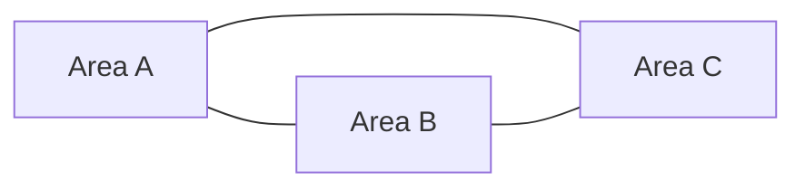

# Layout map — `<island-id>`

**Island name:** _TBD_  
**Tier:** _family | teen | adult_  
**Version:** 0.1 Draft  
**Author / date:** _name · YYYY-MM-DD_

---

## 1. Island summary

| Field | Value |
|-------|-------|
| **Theme** | _One-line theme_ |
| **Entry point** | _Hub → travel → first area_ |
| **Session length** | _Target minutes to island badge_ |
| **Area count** | _3–5_ |

---

## 2. Topology

### Mermaid (area graph)



### ASCII map

```
        [Landmark A — Area name]
              |
    [Area B]--+--[Area C]
              |
        [Landmark B — Area name]
```

**Legend:** `---` walkable connection · `[GATE: item_id]` locked until item collected

---

## 3. Area table

| Area ID | Display name | Icon | Connections | Gate (`requiredItems`) | Hero landmark |
|---------|--------------|------|-------------|------------------------|---------------|
| | | | | — | |

---

## 4. Landmark register (W1–W3)

| Landmark | Area | Visual hook | Learning tie-in |
|----------|------|-------------|-----------------|
| | | | |

---

## 5. Gates & unlocks

| Gate | Blocks | Unlock condition | Signpost (W4) — where player learns first |
|------|--------|------------------|---------------------------------------------|
| | | | |

---

## 6. Wayfinding signpost table (W5–W7)

| Beat | Player question | Answer in UI (quest hint / NPC / travel) |
|------|-----------------|------------------------------------------|
| Start | Where do I go? | |
| Mid | Where is _NPC_? | |
| Gate | Why is _area_ locked? | |

---

## 7. NPC placement

| NPC ID | Name | Area | Role | Quest link |
|--------|------|------|------|------------|
| | | | quest-giver / flavor | |

---

## 8. Items & pickups

| Item ID | Name | Area (spawn) | Used for |
|---------|------|--------------|----------|
| | | | gate / quest / badge |

---

## 9. Minigame anchors

| Minigame ID | Area | Triggered by |
|-------------|------|--------------|
| | | quest objective / NPC effect |

---

## 10. Wayfinding review

| Rule | Pass? | Notes |
|------|-------|-------|
| W1 Rule of three landmarks | ☐ | |
| W2 One hero per area | ☐ | |
| W3 Landmark ↔ learning | ☐ | |
| W4 Signpost before gate | ☐ | |
| W8 No orphan areas | ☐ | |
| W9 Triangle or spine topology | ☐ | |

---

## Revision log

| Version | Date | Change |
|---------|------|--------|
| 0.1 | | Initial layout |
