# Quest pacing chart — `<island-id>`

**Island name:** _TBD_  
**Tier:** _family | teen | adult_  
**Version:** 0.1 Draft  
**Target session:** _10–15 min (family) · 20–30 min (teen/adult)_  
**Author / date:** _name · YYYY-MM-DD_

---

## 1. Pacing goals

| Goal | Target |
|------|--------|
| Time to first quest (`quest_started`) | < 3 min |
| Time to first minigame | _min_ |
| Full island badge | _min_ |
| Quest completion rate (beta) | ≥ 70% |

---

## 2. Session timeline

```mermaid
gantt
    title Island session (target)
    dateFormat X
    axisFormat %M min

    section Onboard
    Hub + travel           :0, 1
    First NPC + quest      :1, 3

    section Quest 1
    Teach beat             :3, 5
    Practice (minigame)    :5, 8
    Reward                 :8, 9

    section Quest 2
    Teach beat             :9, 11
    Gate + travel          :11, 12
    Finale + badge         :12, 15
```

---

## 3. Quest beat table

| Min | Quest ID | Objective | Beat type | Teach moment | Wayfinding cue |
|-----|----------|-----------|-----------|--------------|----------------|
| 0 | — | Enter island | Orient | — | HUD area badge |
| | | | | | |

**Beat types:** `orient` · `teach` · `practice` · `gate` · `reward` · `finale`

---

## 4. Learning coverage

| Learning objective (provenance) | Quest / minigame | Verified |
|---------------------------------|------------------|----------|
| | | ☐ |

---

## 5. Hint escalation

| Quest ID | Base hint (`hint` field) | After 1 fail | After 2 fails |
|----------|--------------------------|--------------|---------------|
| | | (engine: same + 💡) | (+ 🔑 Try: next objective) |

---

## 6. Rewards & juice beats

| Min | Trigger | Reward | Juice (Phase 5) |
|-----|---------|--------|-----------------|
| | `quest_completed` | coins / XP / item | toast · SFX · particles |

---

## 7. Minigame pacing

| Minigame ID | Quest | Attempt expected | Fail retry copy | Pass unlocks |
|-------------|-------|------------------|-----------------|--------------|
| | | 1–2 | | next objective |

---

## 8. Dialogue / trigger map

| Trigger | Effect | Quest impact |
|---------|--------|--------------|
| Talk NPC _x_ | `startQuest` | |
| Choice _y_ | `giveItem` | gate unlock |

---

## 9. Playtest notes

| Date | Player | Time to first quest | Total to badge | Confusion points |
|------|--------|---------------------|----------------|------------------|
| | | | | |

---

## 10. Status

| Milestone | Date | Version |
|-----------|------|---------|
| Outline (Phase 1) | | 0.1 |
| Blockout (Phase 3) | | 0.5 |
| Scripting lock (Phase 4) | | 0.9 |
| Ship (Phase 5) | | **1.0 Final** |

---

## Revision log

| Version | Date | Change |
|---------|------|--------|
| 0.1 | | Initial chart |
