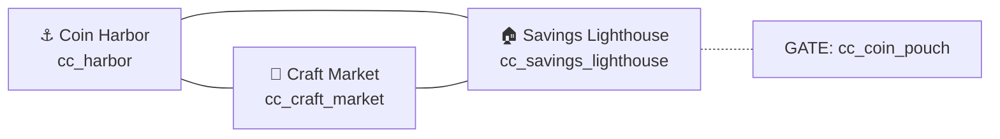

# Layout map — `coincraft_cove`

**Island name:** Coincraft Cove  
**Tier:** Family (elementary, ages 6–11)  
**Version:** 1.0 Final  
**Author / date:** Design · 2026-06-04

---

## 1. Island summary

| Field | Value |
|-------|-------|
| **Theme** | Cozy seaside craft village — earn, spend wisely, save for bigger goals |
| **Entry point** | Hub → Travel → **Coin Harbor** (`cc_harbor`) — default spawn |
| **Session length** | 12–15 min to **Coincraft Badge** |
| **Area count** | 3 (triangle hub) |

---

## 2. Topology

### Mermaid (area graph)



### ASCII map

```
              [SAVINGS LIGHTHOUSE 🏠]
               glowing coin jar (hero)
                    /    \
                   /      \
    [CRAFT MARKET 🎨] ---- [COIN HARBOR ⚓]
     striped awning          dock + boat
           |                      |
      Alma + Shelly           Captain Penny
                                Coin Pouch pickup

  GATE: Lighthouse paths require cc_coin_pouch (learned at Harbor)
```

**Legend:** All areas connected — player can always walk to adjacent zone. Lighthouse is **signposted locked** until Coin Pouch collected.

---

## 3. Area table

| Area ID | Display name | Icon | Connections | Gate (`requiredItems`) | Hero landmark |
|---------|--------------|------|-------------|------------------------|---------------|
| `cc_harbor` | Coin Harbor | ⚓ | market, lighthouse | — (spawn) | Wooden dock + bobbing boat |
| `cc_craft_market` | Craft Market | 🎨 | harbor, lighthouse | — | Striped coral/gold awning |
| `cc_savings_lighthouse` | Savings Lighthouse | 🏠 | harbor, market | `cc_coin_pouch` | Red-white tower + glowing jar |

---

## 4. Landmark register (W1–W3)

| Landmark | Area | Visual hook | Learning tie-in |
|----------|------|-------------|-----------------|
| **Harbor Dock & Boat** | Coin Harbor | Horizontal dock, teal boat, crates | **Earning** — where first coins arrive |
| **Market Awning** | Craft Market | Coral/gold stripes, stall counters | **Spending choices** — needs vs wants |
| **Savings Lighthouse** | Savings Lighthouse | Red stripes, yellow savings jar glow | **Saving** — patience, coins grow over time |

---

## 5. Gates & unlocks

| Gate | Blocks | Unlock condition | Signpost (W4) — where player learns first |
|------|--------|------------------|---------------------------------------------|
| Lighthouse entry | `cc_savings_lighthouse` when no pouch | Collect `cc_coin_pouch` at Harbor | Captain Penny dialogue cp2: “Grab that Coin Pouch on the dock” |
| Lighthouse (UI) | Travel/explore row shows 🔒 | `cc_coin_pouch` in inventory | Quest hint q_cc_save_or_spend: “head to the **Savings Lighthouse**” (after pouch) |

---

## 6. Wayfinding signpost table (W5–W7)

| Beat | Player question | Answer in UI (quest hint / NPC / travel) |
|------|-----------------|------------------------------------------|
| Land on island | Where do I start? | Spawn at **Coin Harbor**; only Captain Penny has quest dialogue |
| Quest 1 start | Who teaches coins? | Captain Penny: “Start at Coin Harbor and talk to Captain Penny” (`q_cc_first_coins` hint) |
| After pouch | Where next? | Quest log: collect pouch → minigame; Alma at **Craft Market** for quest 2 |
| Gate | Why lighthouse locked? | Explore row: 🔒 until pouch; Alma/Kira hints assume pouch held |
| Quest 2 finale | Where is the jar? | Keeper Kira at **Savings Lighthouse** — hint names lighthouse |
| Lost | What now? | Quest panel **➡️ Next:** names NPC + implied area |

---

## 7. NPC placement

| NPC ID | Name | Area | Role | Quest link |
|--------|------|------|------|------------|
| `npc_captain_penny` | Captain Penny | Coin Harbor | Quest 1 giver | `q_cc_first_coins` |
| `npc_artisan_alma` | Artisan Alma | Craft Market | Quest 2 giver | `q_cc_save_or_spend` |
| `npc_shelly` | Shelly the Shell Seller | Craft Market | Flavor / optional trade copy | — |
| `npc_keeper_kira` | Keeper Kira | Savings Lighthouse | Quest 2 finisher | gives `cc_savings_jar` |

---

## 8. Items & pickups

| Item ID | Name | Area (spawn) | Used for |
|---------|------|--------------|----------|
| `cc_coin_pouch` | Coin Pouch | Coin Harbor | Gate key → lighthouse; quest 1 objective |
| `cc_savings_jar` | Savings Jar | Savings Lighthouse (via Kira) | Quest 2 objective; teach saving |
| `cc_craft_badge` | Coincraft Badge | Reward (quest 2) | Island completion proof |

---

## 9. Minigame anchors

| Minigame ID | Area | Triggered by |
|-------------|------|--------------|
| `mg_coin_sort` | Coin Harbor (logical) | `q_cc_first_coins` objective 3 — after pouch |

---

## 10. Wayfinding review

| Rule | Pass? | Notes |
|------|-------|-------|
| W1 Rule of three landmarks | ✅ | Dock, awning, lighthouse |
| W2 One hero per area | ✅ | AreaScene SVG heroes per zone |
| W3 Landmark ↔ learning | ✅ | Lighthouse = saving metaphor |
| W4 Signpost before gate | ✅ | Penny + hint before lighthouse gate |
| W8 No orphan areas | ✅ | Shelly adds flavor at market |
| W9 Triangle or spine topology | ✅ | 3-node triangle, no maze |

---

## Revision log

| Version | Date | Change |
|---------|------|--------|
| 0.1 | 2026-05 | Initial triangle layout |
| 0.5 | 2026-05 | Gate on lighthouse + signpost copy |
| 1.0 | 2026-06-04 | Final — matches `coincraft-cove.islands.json` |
