# Quest pacing chart — `coincraft_cove`

**Island name:** Coincraft Cove  
**Tier:** Family (elementary)  
**Version:** 1.0 Final  
**Target session:** 12–15 min to badge  
**Author / date:** Design · 2026-06-04

---

## 1. Pacing goals

| Goal | Target |
|------|--------|
| Time to first quest (`quest_started`) | < 3 min |
| Time to first minigame | ~5 min |
| Full island badge | 12–15 min |
| Quest completion rate (beta) | ≥ 70% |

---

## 2. Session timeline

```mermaid
gantt
    title Coincraft Cove — target session
    dateFormat X
    axisFormat %M min

    section Onboard
    Hub travel to harbor     :0, 1
    Meet Captain Penny       :1, 3

    section Quest 1 — First Coins
    Teach denominations      :3, 5
    Collect Coin Pouch       :5, 6
    Coin Sort minigame       :6, 9
    Reward 30 coins 60 XP    :9, 10

    section Quest 2 — Save or Spend
    Alma needs vs wants      :10, 12
    Travel to lighthouse     :12, 13
    Kira savings jar         :13, 14
    Badge reward             :14, 15
```

---

## 3. Quest beat table

| Min | Quest ID | Objective | Beat type | Teach moment | Wayfinding cue |
|-----|----------|-----------|-----------|--------------|----------------|
| 0 | — | Enter island @ Harbor | Orient | Island description in HUD | ⚓ Coin Harbor badge |
| 1 | — | Open explore / talk | Orient | Captain Penny visible in NPC list | Portrait + name in row |
| 2 | `q_cc_first_coins` | Talk Captain Penny | Teach | “penny 1¢ … quarter 25¢” (cp2) | Quest starts; hint names Harbor |
| 3 | `q_cc_first_coins` | Collect Coin Pouch | Practice | Pouch on dock (same area) | Item row in Harbor panel |
| 5 | `q_cc_first_coins` | Complete `mg_coin_sort` | Practice | Sort denominations minigame | Quest log ➡️ Next |
| 9 | `q_cc_first_coins` | (quest complete) | Reward | +30 coins, +60 XP | Toast / juice (Phase 5) |
| 10 | `q_cc_save_or_spend` | Talk Artisan Alma | Teach | Needs vs wants (aa2) | Travel → Craft Market 🎨 |
| 11 | `q_cc_save_or_spend` | Talk Keeper Kira | Teach | Saving jar metaphor (kk2) | Hint: Savings Lighthouse 🏠 |
| 12 | `q_cc_save_or_spend` | Collect Savings Jar | Gate | `giveItem` via Kira dialogue | Lighthouse unlocked with pouch |
| 14 | `q_cc_save_or_spend` | (quest complete) | Finale | +50 coins, +100 XP, badge | Island complete state |
| 15 | — | Optional Shelly chat | Flavor | Shell seller small talk | Same market — no quest pressure |

**Beat types:** orient → teach → practice → reward → gate → finale

---

## 4. Learning coverage

| Learning objective (provenance) | Quest / minigame | Verified |
|---------------------------------|------------------|----------|
| Identify coins and bills by value | `q_cc_first_coins` + `mg_coin_sort` | ✅ |
| Practice making change for purchases | `mg_coin_sort` (ChangeMaking module) | ✅ |
| Understand needs vs wants | `q_cc_save_or_spend` + Alma dialogue | ✅ |
| Saving now → bigger things later | Kira + Savings Jar | ✅ |

**Mechanics modules:** sorting-categorization · npc-dialogue-tree · speed-collection · quiz-challenge  
**Engine modules (minigame):** `EarnSpend`, `ChangeMaking`

---

## 5. Hint escalation

| Quest ID | Base hint (`hint` field) | After 1 fail | After 2 fails |
|----------|--------------------------|--------------|---------------|
| `q_cc_first_coins` | “Start at Coin Harbor and talk to Captain Penny. She'll teach you about coins!” | 💡 same hint shown | 🔑 Try: Talk to Captain Penny |
| `q_cc_save_or_spend` | “Visit the Craft Market and talk to Alma, then head to the Savings Lighthouse.” | 💡 same hint shown | 🔑 Try: next incomplete objective |

---

## 6. Rewards & juice beats

| Min | Trigger | Reward | Juice (Phase 5) |
|-----|---------|--------|-----------------|
| 9 | `q_cc_first_coins` complete | 30 coins, 60 XP | Quest complete stinger · coin burst |
| 14 | `q_cc_save_or_spend` complete | 50 coins, 100 XP, `cc_craft_badge` | Badge modal · lighthouse beam pulse (W11) |
| — | Item pickup | — | Collect SFX · pouch/jar pop |

---

## 7. Minigame pacing

| Minigame ID | Quest | Attempt expected | Fail retry copy | Pass unlocks |
|-------------|-------|------------------|-----------------|--------------|
| `mg_coin_sort` | `q_cc_first_coins` | 1–2 | Hint escalation on quest fail | Quest 1 completion → Alma available |

**Placement rule:** Minigame immediately after pouch pickup — practice before leaving Harbor.

---

## 8. Dialogue / trigger map

| Trigger | Effect | Quest impact |
|---------|--------|--------------|
| Captain Penny choice “Teach me about coins!” | `startQuest` → `q_cc_first_coins` | Quest 1 active |
| Captain Penny cp2 (end) | — | Directs to pouch on dock |
| Alma choice “Sure! What's the difference?” | `startQuest` → `q_cc_save_or_spend` | Quest 2 active (expects pouch) |
| Kira choice “Yes! Show me how saving works.” | `giveItem` → `cc_savings_jar` | Quest 2 collect objective |
| Minigame success | analytics `minigame_completed` | Quest objective 3 complete |

---

## 9. Playtest notes

| Date | Player | Time to first quest | Total to badge | Confusion points |
|------|--------|---------------------|----------------|------------------|
| 2026-05 (paper) | Family walkthrough | ~2 min | ~14 min | Lighthouse lock before pouch — mitigated by Penny line |
| _beta TBD_ | | | | |

---

## 10. Status

| Milestone | Date | Version |
|-----------|------|---------|
| Outline (Phase 1) | 2026-04 | 0.1 |
| Blockout (Phase 3) | 2026-05 | 0.5 |
| Scripting lock (Phase 4) | 2026-05 | 0.9 |
| Ship (Phase 5) | 2026-06-04 | **1.0 Final** |

---

## Revision log

| Version | Date | Change |
|---------|------|--------|
| 0.1 | 2026-04 | Two-quest spine aligned to VS scope |
| 0.5 | 2026-05 | Minigame beat after pouch; gate pacing |
| 1.0 | 2026-06-04 | Final timings + wayfinding cues |
